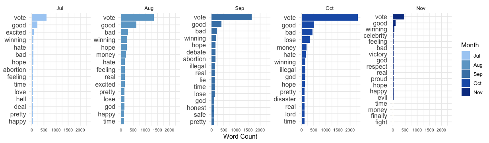
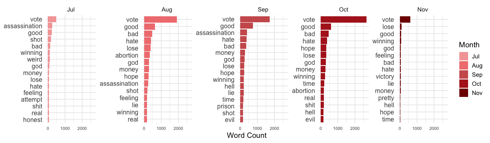
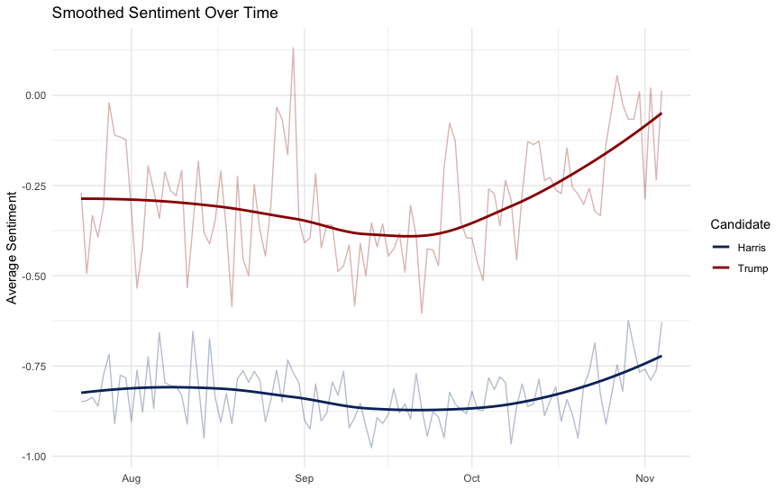

# Political Sentiment Analysis: 2024 U.S. Election

This project analyzes public sentiment on social media (X/Twitter) toward Kamala Harris and Donald Trump during the 5 months leading up to the 2024 U.S. Presidential Election. Combining lexicon-based methods and machine learning, it reveals key differences in how the two candidates were discussed online.

---

## Research Goal

To contextualize the November 2024 election results using sentiment analysis on U.S.-based micro-blogging posts mentioning Harris or Trump.

---

## Methodology

### 1. Data Collection

- **Primary Dataset**: ~18,500 tweets from U.S.-based users (July–November 2024), filtered for opinionated language.
- **Validation Dataset**: 3.4 million tweets pulled from a public GitHub archive to validate trends.

### 2. Lexicon-Based Sentiment Analysis

Used **VADER** and **NRC Emotion Lexicon** to evaluate emotional tone and sentiment intensity.

> *In July, Harris was associated with “hope” and “winning”; by October, her posts were linked to “disaster” and “lose”.*

> *Trump saw less severe changes or increases in negative sentiment and benefited from a small increase in positive sentiment*
### 3. Sentiment Trends

Tracked shifts in sentiment over time using machine-learning predictions.

- **Harris**: Increasing negativity, peaking in October.
- **Trump**: Gradual shift toward positivity by November.

### 4. Machine Learning Classification

Used a two-stage **Random Forest** model:

- **Model 1**: Classifies the candidate the post is about (Harris, Trump, or Neither).
- **Model 2**: Predicts the sentiment of the post (Positive or Negative).

**Performance:**

| Task              | Accuracy |
|-------------------|----------|
| Candidate Model   | 88%      |
| Sentiment Model   | 75%      |

---

## Key Insights

- Harris faced **more frequent and intense negativity** than Trump.
- Trump experienced **more stable sentiment** and gained positivity closer to election day.
- Emotion spikes aligned with real events (e.g., July assassination attempt on Trump).
- Social media conversations tended to skew **more negative overall**.

---

## Limitations

- Small, hand-labeled dataset.
- Imbalanced classes (more negative than positive posts).
- Lexicon-only approaches (like VADER) underperformed ML models.
- Pretrained BERT models (e.g., for movie reviews or general sentiment) did not adapt well to political tone and language.

---

## Repo Structure

sentiment_2024
┣ data/
┃ ┣ tweets_original.csv
┃ ┣ tweets_validation.csv
┣ models/
┃ ┗ rf_sentiment_model.pkl
┣ images/
┃ ┣ word_freq.png
┃ ┣ emotion_trends.png
┃ ┗ confusion_matrix.png
┣ README.md
┣ pull_tweets.py
┣ train_model.py
┗ analyze_sentiment.py
